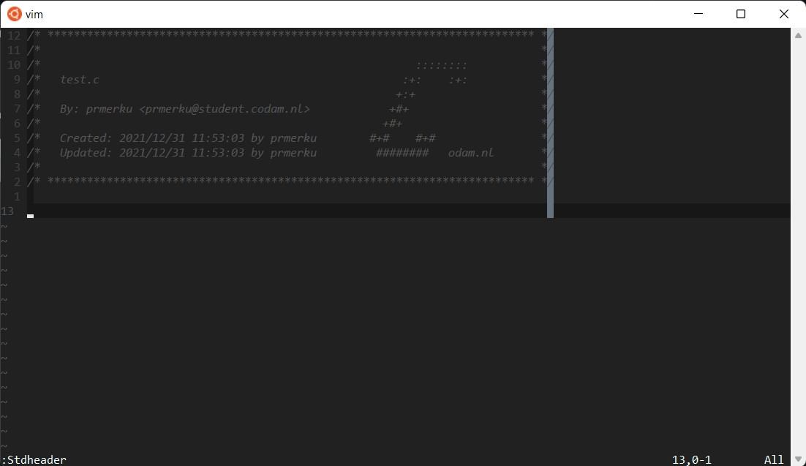

# **42 Header**

42 (Paris)
Codam (Amsterdam)

### **Description**

42 or Codam standard header for vim editor.




### **UNIX Setup**

Copy `stdheader.vim` in your `~/.vim/plugin`, or use your favorite plugin
manager. Then set the user, mail and school variables as explained below.

To install with `Vundle` place this in your `.vimrc`:
```
Plugin 'pmerku/42header'
```
then run the following in Vim:
```
:source %
:PluginInstall
```


#### Option 1: export USER, MAIL and SCHOOL in your shell configuration file

Add in `~/.zshrc` your:

+ `USER`
+ `MAIL`
+ `SCHOOL`

#### Option 2: set user, mail and school values directly in your `vimrc`

```vim
let g:user42 = 'yourLogin'
let g:mail42 = 'yourLogin@student.42.fr'
let g:school42 = 'yourSchoolName'
```

### **Usage**

In **NORMAL** mode you can use `:Stdheader` or simply press the shortcut <kbd>F1</kbd>.

Under **Linux** you eventually need to disable the **help** shortcut of your **terminal** :

For **Terminator**, right click -> Preferences -> Shortcuts -> change help with something other than <kbd>F1</kbd>

### **Note**

Inside the **clusters** you can easily run:

`$ ./set_header.sh [schoolname] [region]`

### **Credits**

[@zazard](https://github.com/zazard) - creator  
[@alexandregv](https://github.com/alexandregv) - contributor  
[@mjacq42](https://github.com/mjacq42) - contributor  
[@sungmcho](https://github.com/lordtomi0325) - contributor  

### **License**

This work is published under the terms of **[42 Unlicense](https://github.com/gcamerli/42unlicense)**.
